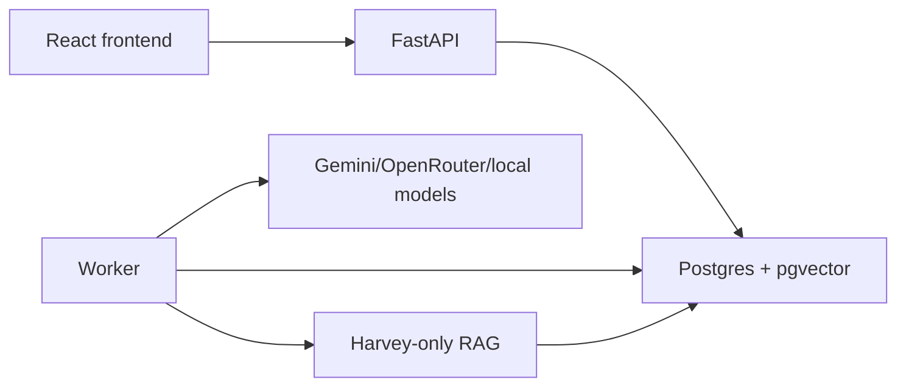

# Architecture

## Pipeline DAG

`input/upload → parse/index → Harvey RAG → Kira problem finding → Admin consensus → output`

Implementation stages:

`create_run → ingest_pdf → parse_ocr_normalize → clause_index → harvey_context_load → kira_review_block → admin_merge → awaiting_human_review → finalized`

`final_review_block`, `harvey_review_block`, and `kira_context_load` are legacy-only and must not be re-enqueued.

## Review Topology

- Harvey: RAG/evidence retrieval only.
- Kira: finds contract problems using contract text, structured compliance context, and Harvey RAG evidence as read-only support.
- Admin: merge-only consensus and deduplication over Kira findings with Harvey evidence attached.
- Human: approve, edit, or reject merged findings.

## RAG Boundary

Harvey can query pgvector RAG. Kira does not call RAG directly; it receives Harvey retrieval traces as context.
